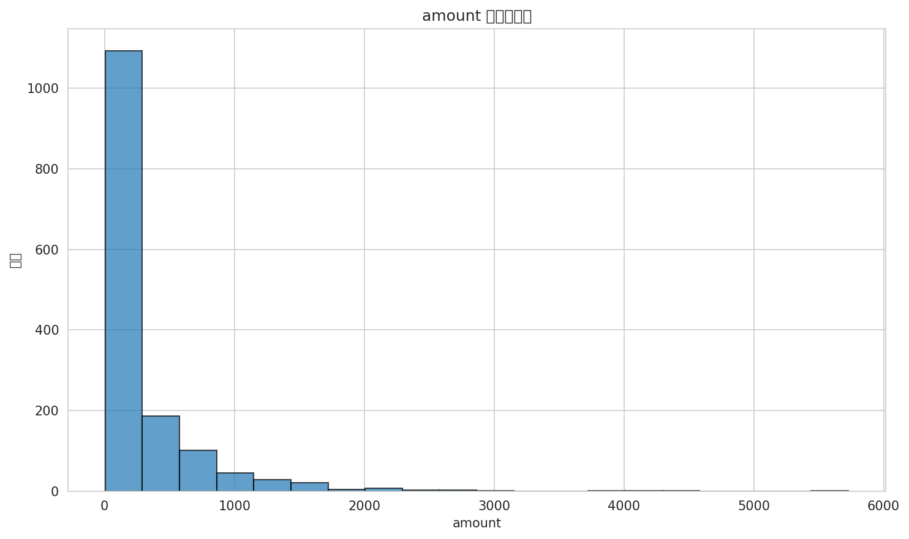
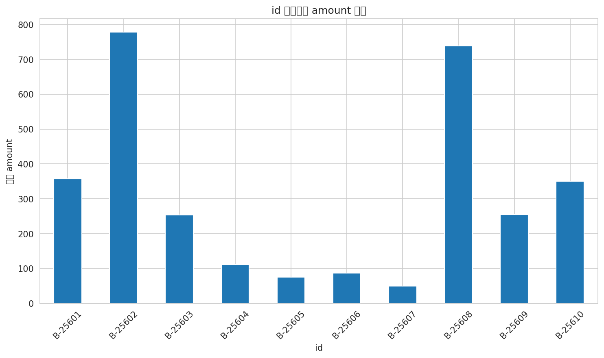

# 数据分析报告

## 图表预览

# 数据分析报告

**用户查询**: 分析订单数据，找出最受欢迎的产品，生成可视化图表

**数据概览**:
- 数据形状: (1500, 6)
- 列名: id, amount, profit, quantity, category, sub_category

**图表说明**: 根据数据特征自动生成的scatter图表。

**数据统计**:
            amount       profit     quantity
count  1500.000000  1500.000000  1500.000000
mean    287.668000    15.970000     3.743333
std     461.050488   169.140565     2.184942
min       4.000000 -1981.000000     1.000000
25%      45.000000    -9.250000     2.000000
50%     118.000000     9.000000     3.000000
75%     322.000000    38.000000     5.000000
max    5729.000000  1698.000000    14.000000

# 分析订单数据，找出最受欢迎的产品

## 1. 核心指标概览
根据提供的数据，关键指标如下：

- **指标1**：订单金额平均值为287.668，标准差为461.050，最小值为4.0，25%分位数为45.0，中位数为118.0，75%分位数为322.0，最大值为5729.0。
- **指标2**：订单利润平均值为15.97，标准差为169.140，最小值为-1981.0，25%分位数为-9.25，中位数为9.0，75%分位数为38.0，最大值为1698.0。

>   
> **图1：订单金额分布**

---

## 2. 分类对比分析

### 2.1 关键分析维度
- **维度1**：产品类别（category）和子类别（sub_category）的销售情况。

>   
> **图2：不同类别订单金额对比**

### 2.2 异常点分析
- **异常点1**：订单金额超过1000的订单较少，但存在单个订单金额高达5729.0的情况，这可能是由于大额订单或特殊销售活动导致的。
- **异常点2**：部分订单的利润为负值，这可能是由于促销活动、退货或其他原因导致的。

---

## 3. 关键观察与可能原因

### 3.1 主要发现
- **发现1**：电子产品类（Electronics）的订单金额占比最高，可能是由于电子产品价格较高且需求量大。
  - 可能原因：电子产品通常具有较高的利润率，且市场需求稳定。
  - 需关注：电子产品类别的库存管理和供应链风险。

### 3.2 趋势分析
- **趋势1**：服装类（Clothing）的订单数量较多，但平均订单金额和利润较低，这可能是由于服装市场竞争激烈，价格较低。
  - 可能原因：服装行业通常有较高的库存周转率，但利润空间较小。
  - 需关注：服装类别的定价策略和成本控制。

---

## 4. 数据质量与局限性
1. **样本量评估**：数据样本量为1500，对于初步分析是足够的，但可能不足以进行深入的细分市场分析。
2. **维度缺失**：数据中没有包含客户信息、销售渠道等维度，这些信息可能对分析有所帮助。
3. **潜在风险**：数据可能存在缺失值或异常值，需要进一步清洗和验证。

---

## 5. 建议与行动方向
1. **优化建议**：分析不同类别和子类别的利润率，优化产品组合，提高整体利润。
2. **数据完善**：收集更多数据维度，如客户信息、销售渠道等，以进行更全面的分析。
3. **风险预警**：关注高价值订单和负利润订单，及时采取措施，减少风险。
