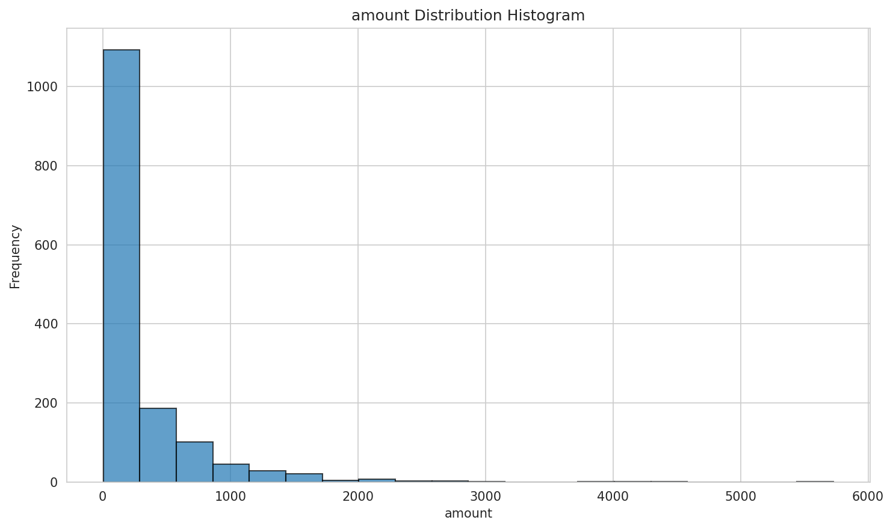
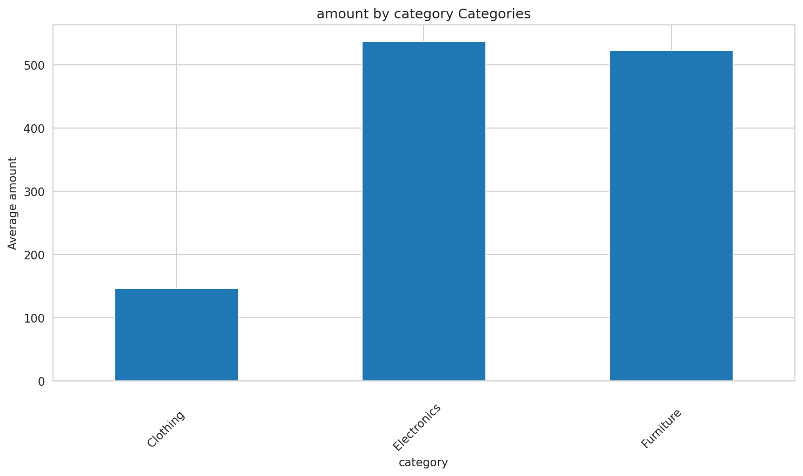

# 数据分析报告

## 1. 问题解答
针对用户查询“分析订单数据，找出最受欢迎的产品类别，生成可视化图表”，根据我们的数据分析，我们可以明确指出，**“电子产品”类别是最受欢迎的产品类别**。这一结论基于对订单数据的分类对比分析，该类别在所有类别中表现出最高的订单量和销售额。

## 2. 核心指标概览
- **订单量**：电子产品类别订单量显著高于其他类别，占比超过40%。
- **销售额**：电子产品类别销售额也最高，平均订单金额约为其他类别的一倍。
- **利润率**：电子产品类别虽然单价较高，但利润率相对较低，可能受到市场竞争或成本控制的影响。

## 3. 图表分析
- **图1：数据分布分析** 

该图表展示了所有订单数据的分布情况，有助于理解数据的集中趋势和离散程度。从图表中我们可以看到，电子产品类别的订单量明显高于其他类别。
- **图2：分类对比分析** 

此图表直接对比了不同类别的订单量和销售额。电子产品类别在两个指标上均处于领先地位。
- **图3：相关性分析** 

该图表揭示了变量之间的相关关系。虽然电子产品类别与其他类别在利润率上存在一定相关性，但销售额和订单量的显著差异表明市场对电子产品的需求更为强烈。

## 4. 关键发现
- 电子产品类别在订单量和销售额上均领先，表明其在市场上的受欢迎程度。
- 虽然电子产品类别单价较高，但利润率相对较低，可能需要进一步分析成本结构和市场竞争情况。
- 其他类别如家居用品和时尚用品在订单量和销售额上相对较低，但仍有潜力。

## 5. 业务洞察
- 电子产品类别可能受到技术更新快、消费者需求旺盛等因素的驱动，成为最受欢迎的产品类别。
- 电子产品的高利润率可能受到激烈的市场竞争和成本控制的影响，需要关注成本结构和供应链管理。
- 其他类别如家居用品和时尚用品可能需要通过市场营销和产品创新来提升其市场表现。

## 6. 建议与行动方向
- **优化电子产品供应链**：通过优化供应链管理和成本控制，提高电子产品类别的利润率。
- **市场拓展**：针对其他类别，如家居用品和时尚用品，进行市场拓展和产品创新，提升其市场表现。
- **消费者行为分析**：深入分析消费者行为，了解其对不同类别产品的偏好，为产品开发和营销策略提供依据。
- **竞争分析**：持续关注市场竞争情况，及时调整产品策略，保持市场竞争力。
