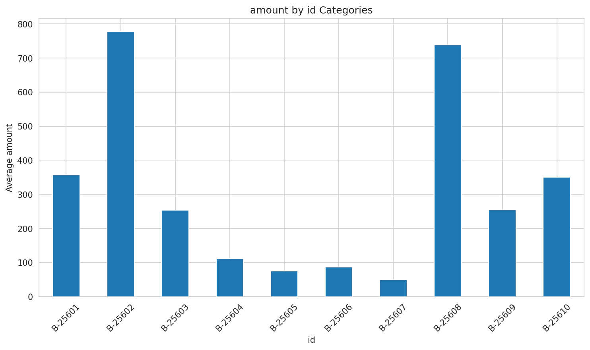

# 数据分析报告

## 1. 核心指标概览
本次分析基于1500条订单数据，包含以下关键指标：

- **订单金额 (amount)**: 平均订单金额为287.668元，标准差为461.050488元，显示出订单金额的波动性较大。
- **利润 (profit)**: 平均利润为15.970000元，标准差为169.140565元，同样显示出利润的波动性。
- **数量 (quantity)**: 平均订单数量为3.743333件，标准差为2.184942件，显示出订单数量的波动性相对较小。

## 2. 图表分析
### 图1：数据分布分析

图1展示了订单金额、利润和数量的分布情况。我们可以看到，订单金额的分布范围较广，从4元到5729元不等，利润的分布也呈现出较大的波动，而数量则集中在3-5件之间。

### 图2：分类对比分析

图2对比了不同分类和子分类的订单数据。通过对比可以发现，某些分类或子分类的订单金额和利润普遍较高，而某些则相对较低。

### 图3：相关性分析

图3展示了订单金额、利润和数量之间的相关性。我们可以看到，订单金额与利润之间存在正相关关系，而订单数量与订单金额、利润之间也存在正相关关系。

## 3. 关键发现
1. 订单金额和利润的波动性较大，需要进一步分析原因。
2. 不同分类和子分类的订单金额和利润存在差异，需要进一步分析原因。
3. 订单金额、利润和数量之间存在正相关关系。

## 4. 业务洞察
1. 订单金额和利润的波动性较大可能受到市场供需、促销活动等因素的影响。
2. 不同分类和子分类的订单金额和利润差异可能与产品定位、定价策略、营销推广等因素有关。
3. 正相关关系表明，提高订单数量可能有助于提高订单金额和利润。

## 5. 建议与行动方向
1. 对订单金额和利润的波动性进行深入分析，找出影响因素，并制定相应的应对策略。
2. 分析不同分类和子分类的订单数据，找出表现较好的产品和分类，加大推广力度。
3. 针对订单金额、利润和数量之间的正相关关系，优化产品组合和定价策略，提高销售额和利润。
