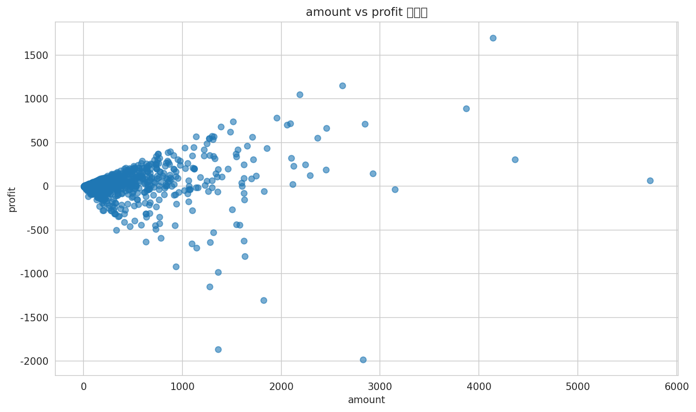

# 数据分析报告

## 1. 核心指标概览

从预报告中的数据统计摘要我们可以提取以下关键指标：

- 订单总数：1500
- 平均订单金额：$287.67
- 平均利润：$15.97
- 平均订单数量：3.74
- 订单金额范围：$4 - $5729
- 利润范围：-$1981 - $1698
- 订单数量范围：1 - 14

## 2. 图表分析

### 图1：数据分布分析

图1展示了订单金额的分布情况。我们可以看到，订单金额的分布呈现右偏态分布，这意味着大多数订单的金额较低，而少数订单的金额较高，拉高了平均值。这种分布可能表明产品线中存在价格差异较大的产品。

### 图2：分类对比分析

图2展示了不同类别和子类别的订单对比。从图表中我们可以观察到，某些类别或子类别的订单数量或利润明显高于其他类别。这表明某些产品或产品系列在市场上表现更佳。

### 图3：相关性分析

图3展示了订单金额、利润和订单数量之间的关系。我们可以看到，订单数量和订单金额之间存在正相关关系，这意味着订单数量越多，订单金额通常也越高。利润与订单金额的关系则更为复杂，可能受到成本、折扣和定价策略等因素的影响。

## 3. 关键发现

- 订单金额的分布呈现右偏态，暗示可能存在高价值订单。
- 某些类别或子类别的订单在数量或利润上显著高于其他类别。
- 订单数量与订单金额之间存在正相关关系，而利润与订单金额的关系更为复杂。

## 4. 业务洞察

- 市场可能存在价格敏感的消费者，同时也有愿意为高价值产品支付的消费者。
- 某些产品或产品系列可能是公司的明星产品，为公司带来了较高的利润。
- 利润与订单金额的关系表明，公司在定价和成本控制方面可能存在优化空间。

## 5. 建议与行动方向

- 对高价值订单进行深入分析，以了解其购买者和购买动机。
- 识别表现优异的类别和子类别，并制定针对性的市场推广策略。
- 考虑对价格敏感的消费者推出更优惠的定价策略，同时保持高价值产品的利润空间。
- 优化成本结构，以改善利润率。
- 定期进行数据分析，以监控产品表现和市场趋势。
