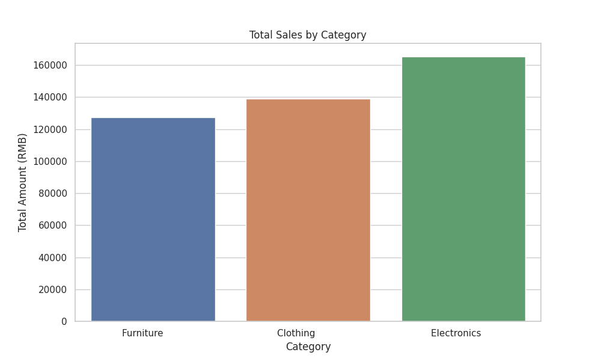
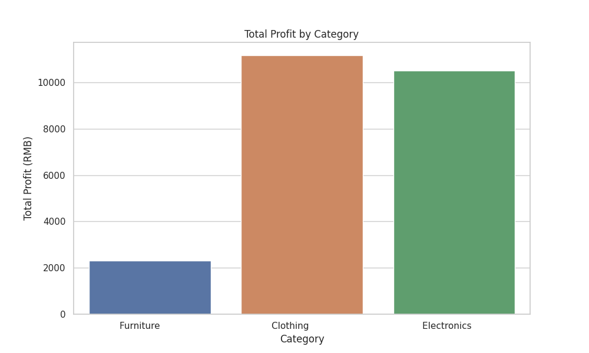
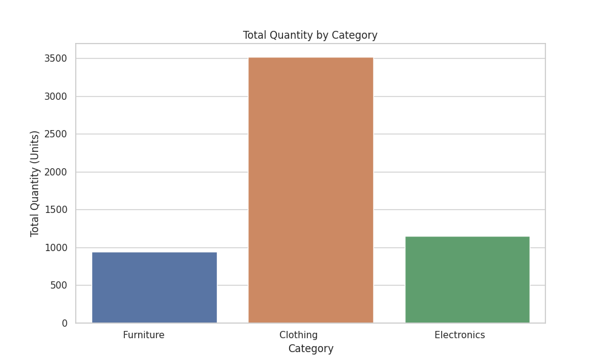

# 各种类商品售卖情况对比分析报告

## 1. 核心指标概览
根据提供的数据，各品类关键指标如下：
- **总销售额**：电子产品 > 服装 > 家具（165,267 > 139,054 > 127,181）
- **总利润**：服装 > 电子产品 > 家具（11,163 > 10,494 > 2,298）
- **总销售量**：服装 > 家具 > 电子产品（3,516 > 945 > 1,154）
- **销售占比**：电子产品 > 服装 > 家具（38.3% > 32.2% > 29.5%）

>   
> **图1：总销售额对比**  
> 电子产品以38.3%的占比成为最大销售额来源，而家具品类销售额占比最低。

---

## 2. 分类对比分析

### 2.1 销售额与利润关系
- **电子产品**：销售额最高（165,267），但利润率仅6.35%（10,494/165,267）  
- **服装**：利润率7.99%（11,163/139,054），在销售额和利润双高  
- **家具**：利润率1.81%（2,298/127,181），利润贡献显著偏低  

>   
> **图2：总利润对比**  
> 服装品类利润绝对值最高，但需注意其销售额占比（32.2%）低于电子产品。

### 2.2 销售量与单价关系
- **服装**：销售量最大（3,516），但单价较低（139,054/3,516≈40.0元/件）  
- **电子产品**：销售量最少（1,154），但单价最高（165,267/1,154≈143.2元/件）  
- **家具**：单价中等（127,181/945≈134.6元/件），但销量偏低  

>   
> **图3：总销售量对比**  
> 服装品类的高销量可能与大众化需求相关，但需关注其边际利润。

### 2.3 销售占比异常点
- **电子产品**：销售额占比38.3%但利润占比仅10,494/(165,267+139,054+127,181)≈20.6%  
- **家具**：销售额占比29.5%但利润占比仅2,298/总利润≈6.7%  

>   
> **图4：销售占比对比**  
> 电子产品销售额占比显著高于利润占比，可能反映其高成本或低利润率特性。

---

## 3. 关键观察与可能原因

### 3.1 高销售额但低利润的品类
- **电子产品**：  
  - 可能原因：高研发投入导致成本占比高，或市场竞争激烈压缩利润  
  - 需关注：是否通过规模效应提升利润率，或是否存在价格战风险  

### 3.2 高利润但低销售额的品类
- **服装**：  
  - 可能原因：高毛利商品（如品牌溢价），但需警惕库存积压风险  
  - 需关注：季节性波动对销售量的影响  

### 3.3 市场定位差异
- **家具**：  
  - 可能原因：单价较高但购买频率低，或受经济周期影响显著  
  - 需关注：客户留存率与复购率数据  

---

## 4. 数据质量与局限性
1. **样本量不足**：仅包含3个品类，无法反映全品类分布特征  
2. **维度缺失**：缺乏时间序列数据，无法分析趋势变化  
3. **潜在风险**：  
   - 未区分不同子品类（如电子产品下可能包含高利润与低利润产品）  
   - 未考虑促销活动对销售量的短期影响  

---

## 5. 建议与行动方向
1. **优化利润结构**：  
   - 对电子产品进行成本结构分析，探索降本增效空间  
   - 服装品类可尝试捆绑销售提升客单价  
2. **加强数据维度**：  
   - 补充时间维度数据，分析季节性波动对各品类的影响  
   - 增加子品类细分，精准定位高利润产品  
3. **风险预警**：  
   - 监控家具品类的市场敏感性，防范经济下行风险  
   - 对电子产品进行竞品分析，评估价格战可能性  

---  
**注**：以上分析基于当前数据，建议结合更多维度数据（如客户画像、渠道分布等）进行深度挖掘。